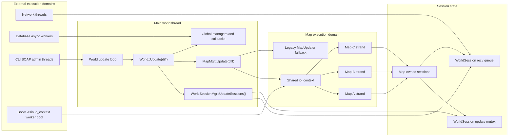
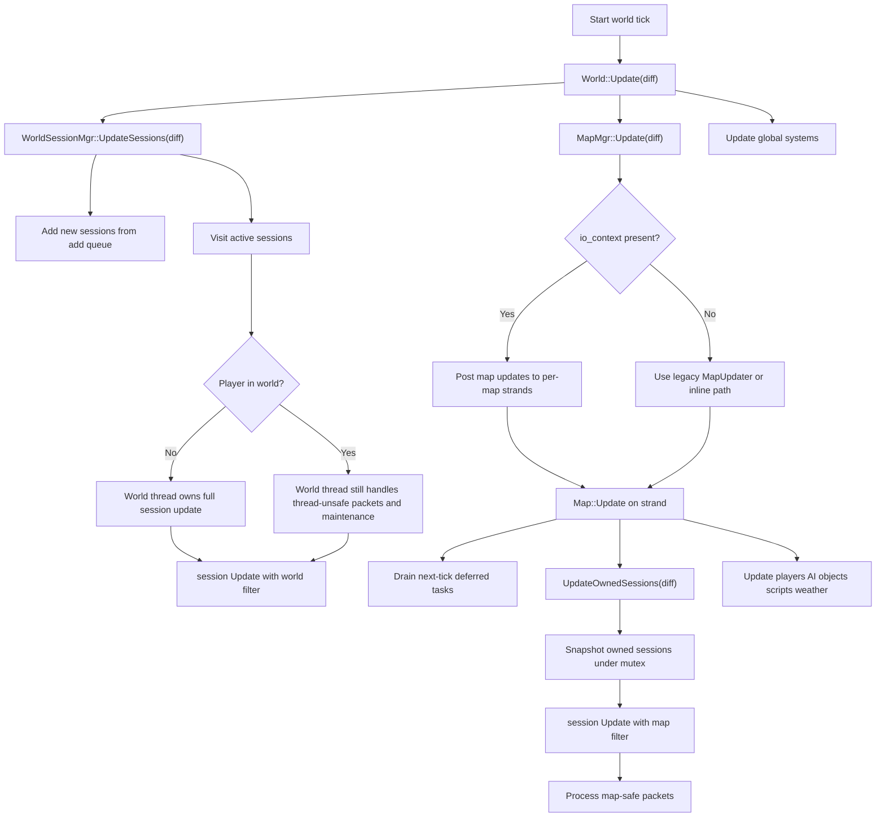
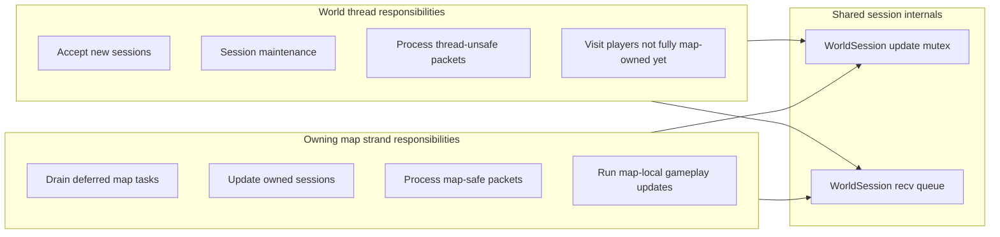
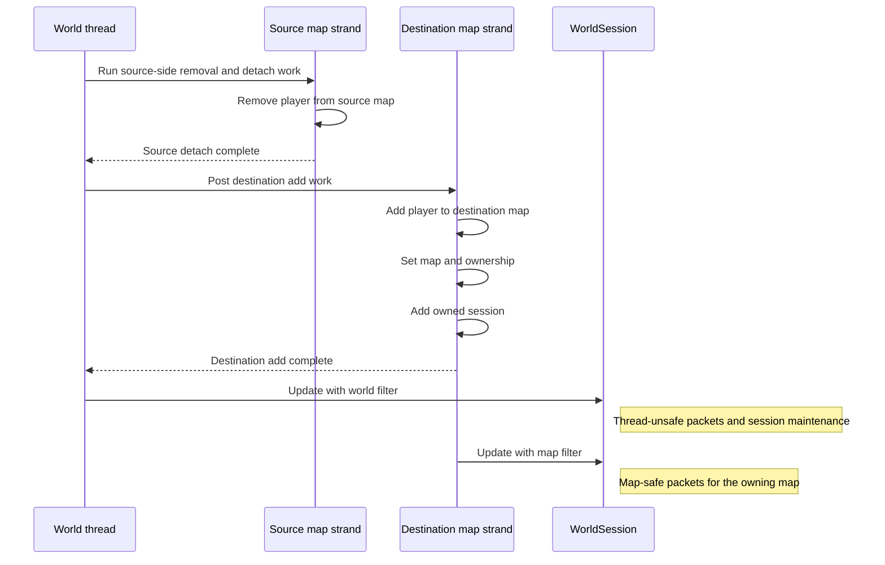
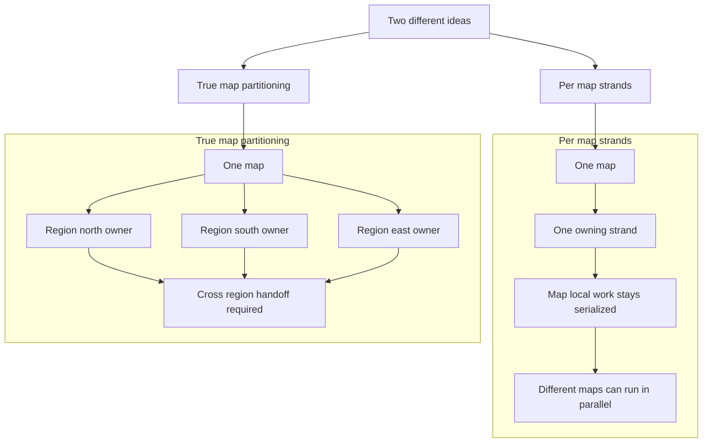
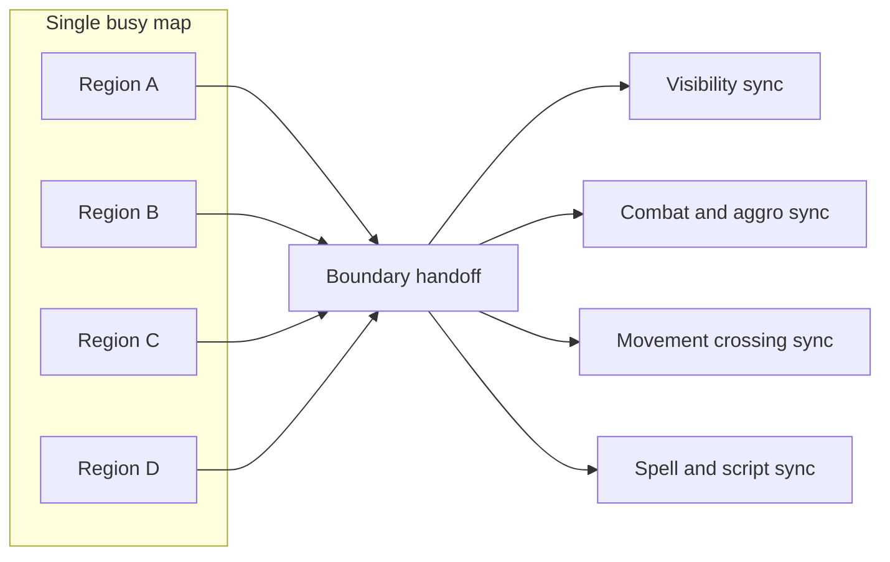

# OMW Threading Architecture

This document explains the current threading model on the `feat/omw-threading` branch, with a focus on:

- the main world thread
- the Boost.Asio execution pool
- per-map strands
- split session ownership during the transition period
- cross-map handoff flow

## Quick mental model

The simplest way to think about this branch is:

- the **world thread** still orchestrates the server tick
- **map work** is pushed onto **per-map strands**
- a **strand is not a thread**; it is a serialized execution lane on top of the shared `io_context`
- tasks posted to the **same strand** never run concurrently
- tasks posted to **different strands** may run in parallel
- `WorldSession` updates are currently **split** between the world thread and the owning map strand

That means the branch is in a transitional state:

- the **world thread** still handles thread-unsafe packet processing and session maintenance
- the **map strand** handles map-safe packet processing for players owned by that map

## Big-picture topology

## Per-tick flow

This is the high-level order of operations during a world tick.

## Session ownership model

This branch currently uses a split ownership model for in-world players.

### What this means

- A player who is in the world may still have work performed by the **world thread**.
- That same player may also have map-safe work performed by the **owning map strand**.
- The session update mutex serializes those calls so they do not run at the same time.
- This is safe, but it is also one of the branch's main transitional bottlenecks.

## Cross-map handoff flow

When work needs to move a player from one map to another, the goal is to mutate each map on its own serialized lane.

## Why strands matter

Without strands, map-local systems need broad manual locking around mutable state such as:

- player containers
- visibility state
- AI state
- creature and object update state
- teleport and handoff bookkeeping

With strands, the design rule becomes simpler:

> If code mutates state owned by a specific map, post that work to that map's strand.

That gives you serialized map-local execution without forcing the whole server back onto a single gameplay thread.

## Per-map strands vs true map partitioning

It is important to distinguish between:

- **per-map strands**: one serialized execution lane per map
- **true map partitioning**: multiple execution owners inside the same map

In the current `feat/omw-threading` design, the system is using **per-map strands**, not full spatial partitioning of a single map.

### What the current branch does

With **per-map strands**, the concurrency boundary is the map itself.

That means:

- all mutable work for a given map is funneled through that map's strand
- the same map does not execute conflicting map-local work concurrently
- different maps may run at the same time on different workers

This is primarily an **execution ownership model**, not a geometric partitioning model.

### What true partitioning would mean

With **true map partitioning**, a single map would be split into multiple independently updated regions.

For example:

- one region owns players and creatures in the north
- another region owns actors in the south
- another region owns actors in the east

That could improve throughput for one very hot map, but it introduces extra coordination whenever game logic crosses a partition boundary.

### Potential upside of true partitioning

If one map becomes the dominant CPU hotspot, true partitioning can help by allowing multiple parts of that same map to update in parallel.

This can be beneficial when:

- the map is extremely busy
- actors interact mostly with nearby actors
- cross-region interaction is limited
- ownership rules are very clear

### Costs of true partitioning

The harder part is not dividing the map visually. The harder part is preserving correct gameplay behavior across partition boundaries.

Typical costs include:

- cross-region movement handoffs
- visibility synchronization across boundaries
- cross-region combat and threat updates
- spell targeting across regions
- more locking or more message passing
- harder debugging and nondeterministic edge cases

### Practical takeaway

For this branch, **per-map strands** are the safer and more practical performance step because they give:

- cleaner ownership
- less locking than a global gameplay thread
- better scalability across many active maps
- much lower implementation risk

**True map partitioning** has a higher theoretical ceiling for a single overloaded map, but also a much higher complexity cost.

### Short summary

Use this rule of thumb:

- **per-map strands** = partition execution by map
- **true map partitioning** = partition execution inside one map

The current branch is doing the first, not the second.

## Current hazards and migration pressure points

### 1. Dual session updaters

The world thread and map strand can both reach `WorldSession::Update()` for in-world sessions.

Effects:

- mutex contention
- more complicated reasoning
- less-than-ideal scaling until more session work fully migrates to map ownership

### 2. Queue head-of-line blocking

Because packet filtering is still transitional, the queue can stall on packets that are meant for the other execution path.

Effects:

- unnecessary latency
- awkward queue behavior under mixed traffic

### 3. Cross-map ownership correctness

Teleport and transfer paths must keep the rule:

- source-map mutation on the source strand
- destination-map mutation on the destination strand

Breaking that rule risks off-strand mutation of map-owned state.

## Best short summary

The branch is moving AzerothCore from a mostly world-thread-driven gameplay model toward a **world-thread-orchestrated, map-strand-executed model**, where each map becomes its own serialized concurrency island.

## Rendering notes

If Mermaid still does not render in your viewer:

- open the Markdown preview in VS Code
- make sure Mermaid support is enabled in the preview environment
- if needed, paste an individual `mermaid` block into a Mermaid live viewer to isolate renderer-specific syntax issues

This file intentionally uses conservative Mermaid syntax to maximize compatibility.
